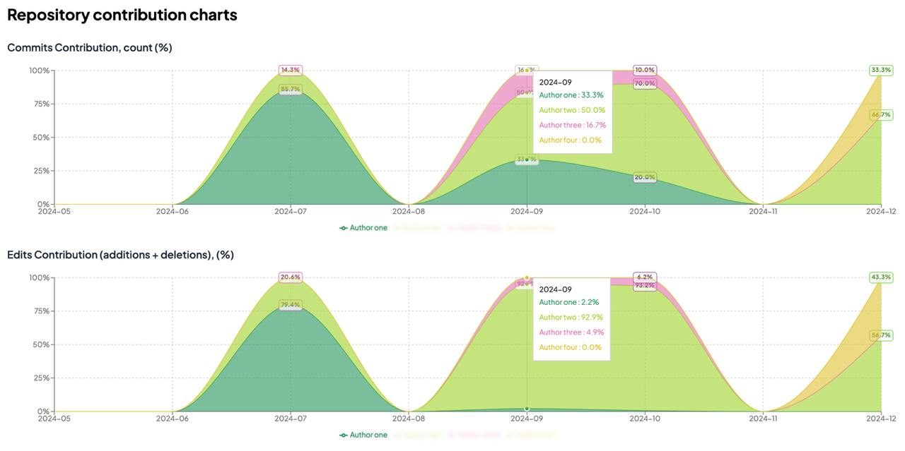

# GitLab Activity Analyzer

A tool for analyzing and visualizing GitLab repository contributions over time.



## Features

- Pull commit statistics from GitLab repositories
- Visualize contributions by team members over time
- Analyze both commit count and edit volume (additions + deletions)
- Group contributors with multiple usernames
- Exclude specific contributors from visualization
- Interactive charts with customizable display options

## Setup

### Prerequisites

- Node.js (v22.11.x or higher)
- pnpm (v9 or higher)
- A GitLab account with access to the repositories you want to analyze
- GitLab Personal Access Token with read_api scope

### Installation

1. Clone the repository:
   ```bash
   git clone https://github.com/tohachan/gitlab-activity-analyzer.git
   cd gitlab-activity-analyzer
   ```

2. Install dependencies:
   ```bash
   pnpm install
   ```

3. Create a `.env` file in the root directory and add your GitLab token:
   ```
   GITLAB_TOKEN=your_gitlab_personal_access_token_here
   ```

   You can generate a Personal Access Token from GitLab by going to:
   Settings > Access Tokens > Create new token (with 'read_api' scope)

## Data Collection

Before using the visualization interface, you need to collect repository data using the `pull-stats` script.

### Basic Usage

```bash
pnpm run pull-stats https://gitlab.com/username/repository
```

### Command Line Arguments

The script supports the following arguments:

- `--interval=<value>` - Set the time grouping interval (default: `day`)
  - Options: `day`, `week`, `month`
  - Example: `--interval=month`

- `--from=<date>` - Set the start date for data collection (default: calculated from `--months`)
  - Format: `YYYY-MM-DD`
  - Example: `--from=2023-01-01`

- `--to=<date>` - Set the end date for data collection (default: today)
  - Format: `YYYY-MM-DD`
  - Example: `--to=2023-12-31`

- `--months=<number>` - Specify how many months to look back from today (default: `1`)
  - Only used if `--from` is not specified
  - Example: `--months=6`

### Examples

```bash
# Collect last 3 months of data grouped by weeks
pnpm run pull-stats https://gitlab.com/username/repository --interval=week --months=3

# Collect data for a specific date range grouped by months
pnpm run pull-stats https://gitlab.com/username/repository --interval=month --from=2022-01-01 --to=2022-12-31
```

### Output

The script will save the collected data as a JSON file in the `src/data` directory. The filename format is:
`{repository-name}_{start-date}_to_{end-date}_{interval}.json`

## Using the UI

After collecting data with the `pull-stats` script, you can use the web interface to visualize and analyze the results.

### Starting the Application

```bash
# Development mode
pnpm run dev

# Build and run in production mode
pnpm run build
pnpm run start
```

### Interface Overview

1. **Data Source Selection**:
   - Use the dropdown menu to select from available data files
   - The list shows data files in the `src/data` directory

2. **Visualization Controls**:
   - Toggle "Show Values" to display percentage labels on chart segments
   - Use "Randomize colors" to change the color scheme
   - Charts are synchronized to make comparison easier

3. **Author Management**:
   - Click "Show Settings" to configure author grouping and exclusions
   - **Author Groups**: Combine multiple GitLab usernames for the same person
     - The first author in each group is the main name displayed in charts
     - Use the move button to change the main author in a group
   - **Exclude Authors**: Hide specific contributors from the visualization

4. **Charts**:
   - Two synchronized charts show contributor percentages over time
   - Top chart: Commit count percentage
   - Bottom chart: Edit volume percentage (additions + deletions)
   - Hover over chart segments to see exact values

## Troubleshooting

### Common Issues

- **API Error: Unauthorized**  
  Make sure your GitLab token is valid and has the necessary permissions.

- **Missing Data in Charts**  
  Verify that the repository has commits in the specified date range.

- **No Data Files Available**  
  Run `pnpm run pull-stats` first to collect repository data.

## Development

### Project Structure

- `/tools` - Data collection scripts
- `/src/data` - Repository data files
- `/src/lib/pages` - React components for UI
- `/src/utils` - Utility functions for data processing

### Running Tests

```bash
pnpm run test
```

This project is bootstrapped with [vite-react-tailwind-starter](https://vite-react-tailwind-starter.sznm.dev/)

## License

[MIT](LICENSE)
